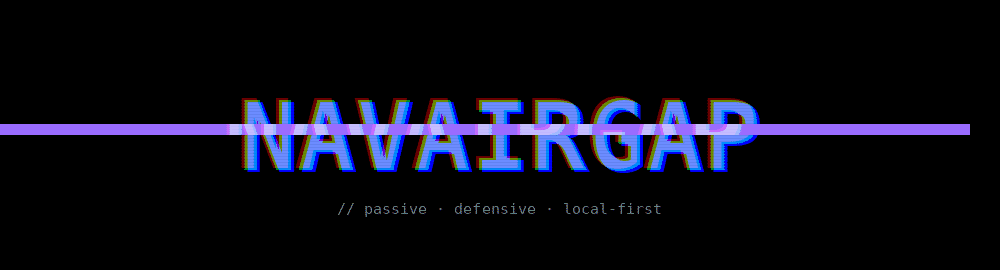
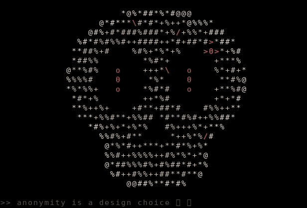
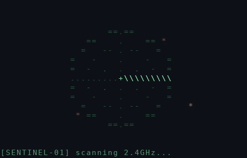
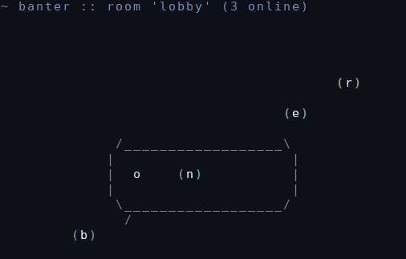

 

<a href="https://navairgap.github.io"><b>🌐 navairgap.github.io — portfolio site →</b></a>

 

- 🔐 **Cybersecurity** — defensive tools only: passive auditing, rogue-device detection, honest reporting
- 🛠️ **Backend developer** — real-time systems, APIs, and the glue between them
- 🌱 **Exploring Web3** — smart contracts and what decentralization is actually good for
- 🐧 Daily driver: **Linux**. If it doesn't run in a terminal, it probably should

## 📟 ASCII corner

  

<i>>>&nbsp; anonymity is a design choice</i>

## 🚀 Featured projects

  
  &nbsp;
  

### 🛡️ &nbsp;[SentinelWiFi](https://github.com/navairgap/SentinelWiFi) — *passive network security auditor*

**Your WiFi, graded A–F, with plain-language fixes.**

🔴 &nbsp;Evil-twin & rogue-DHCP detection &nbsp;·&nbsp; 🟠 &nbsp;WPS / PMF / deauth-resistance checks &nbsp;·&nbsp; 🟡 &nbsp;LAN device inventory with newcomer alarms &nbsp;·&nbsp; 🟢 &nbsp;Exposed-service scanning &nbsp;·&nbsp; 🔵 &nbsp;CI-proven offense-free — `grep`ped on every push

`python` `scapy` `linux` `pytest`

### 💬 &nbsp;[banter](https://github.com/navairgap/banter) — *real-time public chat rooms*

**No accounts. No database. XSS-proof by construction.**

Live rooms & typing indicators &nbsp;·&nbsp; per-room online lists &nbsp;·&nbsp; duplicate-name handling &nbsp;·&nbsp; two-client integration tests &nbsp;·&nbsp; ships in one command

`node.js` `socket.io` `websockets` `express`

## 🛠️ Tech stack

  

  
  
  

## 🐍 Contribution graph

<picture>
  <source media="(prefers-color-scheme: dark)" srcset="dist/github-snake-dark.svg">
  <source media="(prefers-color-scheme: light)" srcset="dist/github-snake.svg">
  
</picture>

  
  
  &nbsp;
  

---

  <i>"The best security tool is the one that's honest about what it doesn't do."</i>

