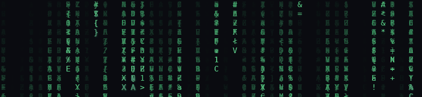

 

## 🧠 About me

- 🔐 **Cybersecurity** — I build **defensive** tools: passive network auditing, rogue-device detection, and honest security reporting. Offense isn't my lane; understanding it well enough to defend against it is.
- 🛠️ **Backend developer** — APIs, real-time systems, and the glue between them.
- 🌱 Currently **exploring Web3** — smart contracts, decentralization, and what they're actually good for.
- 🐧 Daily driver: **Linux**. If it doesn't run in a terminal, it probably should.
- ⚡ Belief: security tools should be **passive, local-first, and honest about what they can't do**.

## 🚀 Featured projects

  
  

**[SentinelWiFi](https://github.com/navairgap/SentinelWiFi)** — a passive,
defensive auditor for your own WiFi and LAN. Evil-twin detection, rogue
DHCP checks, device inventory, exposed-service scanning, A–F grading with
plain-language fixes. CI greps every push to guarantee it stays
offense-free.

**[banter](https://github.com/navairgap/banter)** — real-time public chat
rooms with Socket.IO. No accounts, no database, XSS-proof by
construction.

## 🛠️ Tech stack

**Languages**

**Backend & tools**

**Exploring**

## 📊 GitHub stats

  
  

  

## 🐍 Contribution graph

<picture>
  <source media="(prefers-color-scheme: dark)" srcset="dist/github-snake-dark.svg">
  <source media="(prefers-color-scheme: light)" srcset="dist/github-snake.svg">
  
</picture>
<!-- The snake animation is generated daily by .github/workflows/snake.yml — it appears a few minutes after the first run. -->

## 🌐 Connect

  
  <!-- Add your own: LinkedIn / Twitter(X) / Discord — just duplicate the line above -->

---

  <i>"The best security tool is the one that's honest about what it doesn't do."</i>

