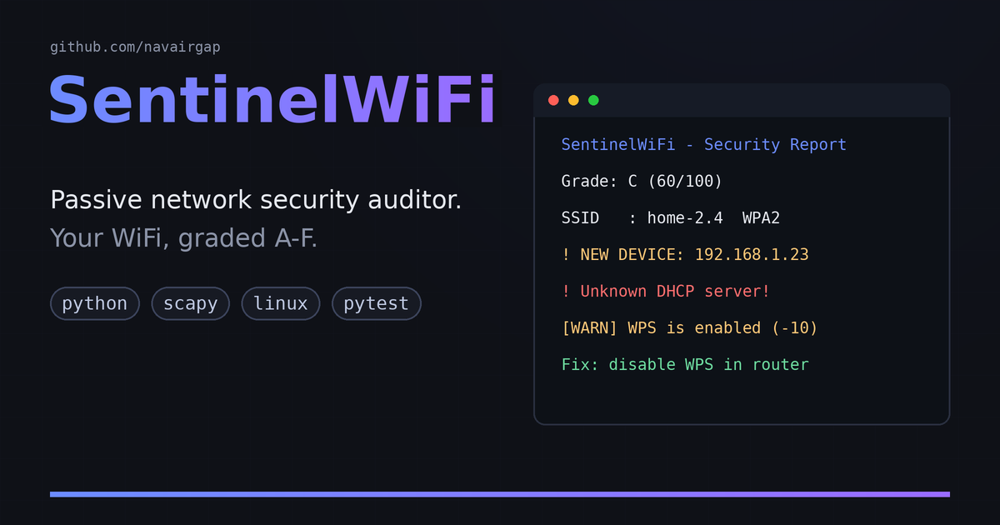
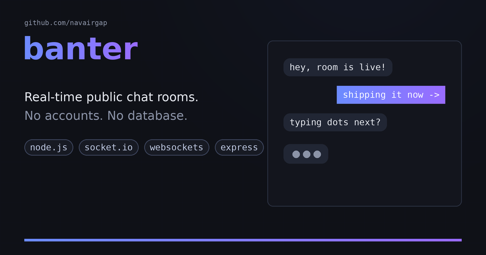

 

 

- 🔐 **Cybersecurity** — defensive tools only: passive auditing, rogue-device detection, honest reporting
- 🛠️ **Backend developer** — real-time systems, APIs, and the glue between them
- 🌱 **Exploring Web3** — smart contracts and what decentralization is actually good for
- 🐧 Daily driver: **Linux**. If it doesn't run in a terminal, it probably should

## 🚀 Featured projects

  
  &nbsp;
  

**[SentinelWiFi](https://github.com/navairgap/SentinelWiFi)** — a passive,
defensive auditor for your own WiFi and LAN. Evil-twin detection, rogue
DHCP checks, device inventory, exposed-service scanning, and an A–F grade
with plain-language fixes. CI greps every push to guarantee it stays
offense-free.

**[banter](https://github.com/navairgap/banter)** — real-time public chat
rooms with Socket.IO. No accounts, no database, XSS-proof by construction.

## 🛠️ Tech stack

  

  
  
  

## 🐍 Contribution graph

<picture>
  <source media="(prefers-color-scheme: dark)" srcset="dist/github-snake-dark.svg">
  <source media="(prefers-color-scheme: light)" srcset="dist/github-snake.svg">
  
</picture>

  
  &nbsp;
  

---

  <i>"The best security tool is the one that's honest about what it doesn't do."</i>

